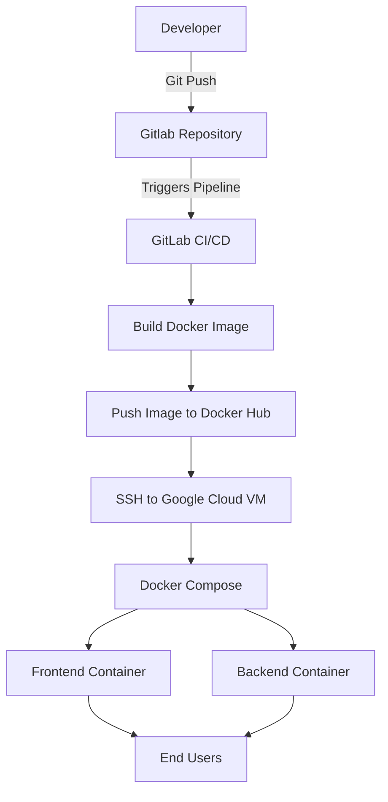

## Project Overview

A full-stack real-time chat application built with Node.js, WebSockets, Docker, and Docker Compose. The application is automatically deployed to a Google Cloud Virtual Machine (VM) through a GitLab CI/CD pipeline, demonstrating a complete containerized deployment workflow.

## Architecture



## Docker Container Setup

The application is containerized using **Docker Compose**, which orchestrates the following services:

- **Backend Container**: Runs the application backend (Python) and exposes port **8000**.
- **Nginx Container**: Serves the frontend, acts as a reverse proxy, and exposes port **80** to clients.
- **Bridge Network**: Both containers communicate over a custom Docker bridge network named **assignment**, enabling secure inter-container communication.
- **Volumes**:
  - `./frontend:/usr/share/nginx/html:ro` – Mounts the frontend files into the Nginx container in read-only mode.
  - `./nginx.conf:/etc/nginx/nginx.conf:ro` – Mounts the custom Nginx configuration file in read-only mode.
- **Container Dependency**: The Nginx container depends on the backend container to ensure the backend service is available before Nginx starts.
- **Restart Policy**: Both containers use `restart: always` to automatically recover from failures.

## Docker Networking

Docker Compose automatically creates an isolated **bridge network** named **assignment** for the application. Both the **Nginx** and **Backend** containers are connected to this network, allowing them to communicate securely using their **service names** instead of IP addresses.

- **Network Driver:** Bridge
- **Network Name:** `assignment`
- **Inter-container Communication:** Nginx communicates with the backend using the service name (`backend`).
- **External Access:** Only the Nginx container exposes **port 80** to the host, while the backend remains accessible only within the Docker network on **port 8000**.


## Nginx Reverse Proxy & WebSocket

Nginx acts as the **entry point** for the application. It serves the frontend files and forwards WebSocket requests to the backend.

### Serving Static Files

```nginx
location / {
    root /usr/share/nginx/html;
    index index.html;
    try_files $uri $uri/ /index.html;
}
```

- This block is used to server static frontend files which we copied in nginx default index.html path using docker columes which was configured in docker-compose file 

### WebSocket Proxy

```nginx
location /ws {
    proxy_pass http://backend:8000/ws;
}
```

Requests to `/ws` are forwarded to the backend container over the Docker network.

### WebSocket Upgrade

```nginx
proxy_http_version 1.1;
proxy_set_header Upgrade $http_upgrade;
proxy_set_header Connection "upgrade";
```

These directives upgrade a normal HTTP request to a WebSocket connection, allowing persistent real-time communication between the client and the backend.


## CI/CD Pipeline

The project uses **GitLab CI/CD** to automate the build and deployment process. Whenever a developer pushes code to the GitLab repository, the pipeline is triggered automatically.

### Build Stage (Continuous Integration)

During the build stage:

- The pipeline reads the application version from `version.txt`.
- A Docker image is built using the project's `Dockerfile`.
- The image is tagged with the version from `version.txt`.
- The versioned image is pushed to Docker Hub.

Using a `version.txt` file helps maintain application versions. Before deploying new changes, the developer updates the version number, ensuring that every release has a unique Docker image tag. This makes it easy to track releases and deploy a specific version when needed.

### Deploy Stage (Continuous Deployment)

During the deploy stage:

- The pipeline connects to the Google Cloud VM using SSH.
- It pulls the required Docker image from Docker Hub.
- Finally, Docker Compose restarts the application with the latest version.


## Challenges Faced & Solutions

| Challenge | Solution |
|-----------|----------|
| Docker Compose failed because the Nginx image could not be pulled due to a timeout. | Pulled the Nginx image manually and restarted the deployment. |
| Nginx displayed the default welcome page instead of the frontend application. | Correctly mounted the frontend directory using Docker volumes and verified the Nginx configuration. |
| The backend was only accessible from `localhost`, preventing other containers from reaching it. | Configured Uvicorn to listen on `0.0.0.0` so it could accept connections from the Docker network. |
| Nginx could not communicate with the backend container. | Connected both containers to the same Docker bridge network and updated the reverse proxy configuration. |
| WebSocket connections were failing and disconnecting immediately. | Uncommented the required WebSocket upgrade headers (`Upgrade` and `Connection`) in the Nginx configuration. |
| The frontend was unable to communicate with the chatbot backend. | Verified Docker networking, backend host configuration, and Nginx proxy settings until WebSocket communication worked successfully. |
| The application had to be deployed manually after every change. | Automated the deployment using GitLab CI/CD, Docker Hub, and SSH-based deployment to the Google Cloud VM. |
| The latest application version was difficult to track during deployments. | Introduced a `version.txt` file to version Docker images and deploy a specific release instead of relying on the `latest` tag. |


## Deployment Process

The application is deployed automatically using **GitLab CI/CD**. Before deploying a new release, the developer must update the version number in `version.txt` to create a new Docker image tag.

The deployment process is as follows:

1. Update the application version in `version.txt`.
2. Commit and push the latest code to the GitLab repository.
3. The GitLab CI/CD pipeline is triggered automatically.
4. The pipeline reads the version from `version.txt`.
5. A Docker image is built using the project's `Dockerfile`.
6. The image is tagged with the version from `version.txt` and pushed to Docker Hub.
7. The deployment stage connects to the Google Cloud VM using SSH.
8. The latest versioned image is pulled from Docker Hub.
9. Docker Compose restarts the application with the updated image.
10. The updated application is available through the VM's public IP address.